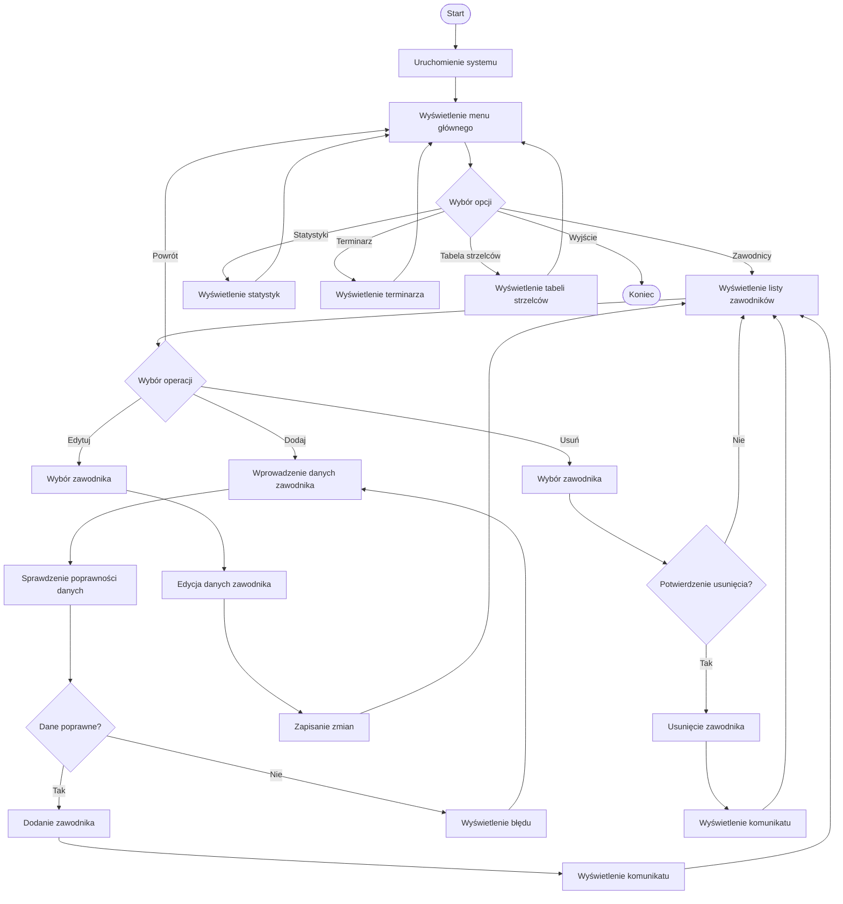

# Diagram aktywności

```mermaid
flowchart TD
    A([Start]) --> B[Uruchomienie systemu]
    B --> C[Wyświetlenie menu głównego]
    C --> D{Wybór opcji}

    D -->|Zawodnicy| E[Wyświetlenie listy zawodników]
    E --> F{Wybór operacji}

    F -->|Dodaj| G[Wprowadzenie danych zawodnika]
    G --> H[Sprawdzenie poprawności danych]
    H --> I{Dane poprawne?}

    I -->|Tak| J[Dodanie zawodnika]
    J --> K[Wyświetlenie komunikatu]
    K --> E

    I -->|Nie| L[Wyświetlenie błędu]
    L --> G

    F -->|Edytuj| M[Wybór zawodnika]
    M --> N[Edycja danych zawodnika]
    N --> O[Zapisanie zmian]
    O --> E

    F -->|Usuń| P[Wybór zawodnika]
    P --> Q{Potwierdzenie usunięcia?}

    Q -->|Tak| R[Usunięcie zawodnika]
    R --> S[Wyświetlenie komunikatu]
    S --> E

    Q -->|Nie| E

    F -->|Powrót| C

    D -->|Statystyki| T[Wyświetlenie statystyk]
    T --> C

    D -->|Terminarz| U[Wyświetlenie terminarza]
    U --> C

    D -->|Tabela strzelców| V[Wyświetlenie tabeli strzelców]
    V --> C

    D -->|Wyjście| W([Koniec])
```
