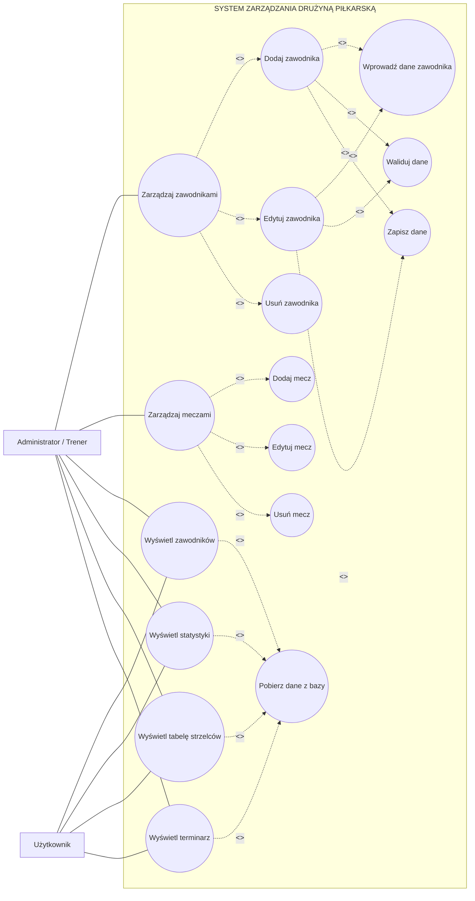

# Rozszerzony diagram przypadków użycia

## System zarządzania drużyną piłkarską

## Opis relacji

### Zarządzaj zawodnikami

Przypadek użycia obejmuje:

- dodawanie zawodnika,
- edytowanie zawodnika,
- usuwanie zawodnika.

### Zarządzaj meczami

Przypadek użycia obejmuje:

- dodawanie meczu,
- edytowanie meczu,
- usuwanie meczu.

### Walidacja danych

Podczas dodawania lub edycji zawodnika system sprawdza,
czy wprowadzone dane są poprawne.

### Zapis danych

Po poprawnej walidacji dane zostają zapisane w bazie danych.

### Pobieranie danych

Wyświetlanie zawodników, statystyk, tabeli strzelców i terminarza
wymaga pobrania odpowiednich danych z bazy.
