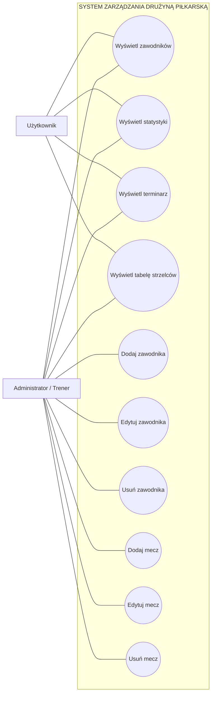

# Diagram przypadków użycia – System zarządzania drużyną piłkarską

## Diagram podstawowy

## Aktorzy

### Użytkownik

Może:

- wyświetlać zawodników,
- przeglądać statystyki,
- przeglądać terminarz,
- przeglądać tabelę strzelców.

### Administrator / Trener

Może dodatkowo:

- dodawać zawodników,
- edytować zawodników,
- usuwać zawodników,
- dodawać mecze,
- edytować mecze,
- usuwać mecze.
