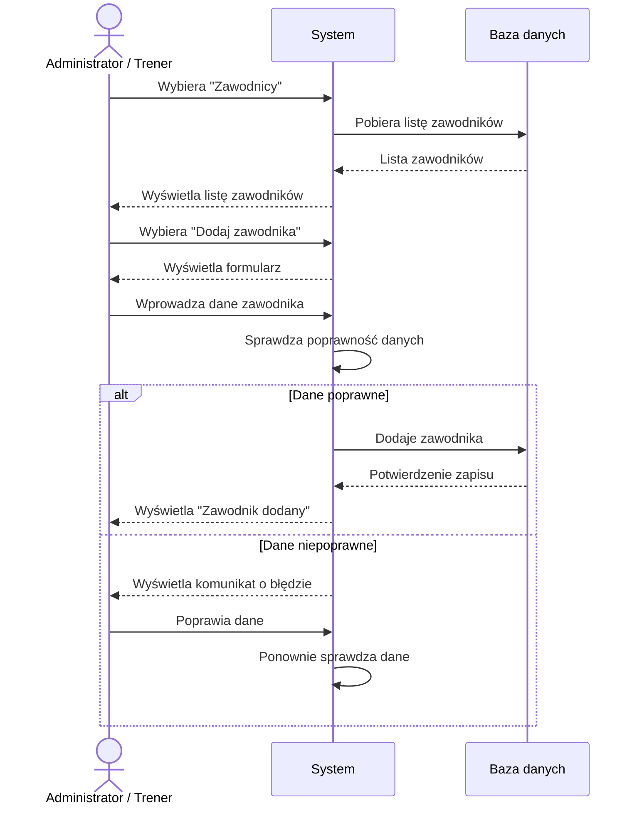

# Diagram sekwencji

```mermaid
sequenceDiagram
    actor AT as Administrator / Trener
    participant S as System
    participant DB as Baza danych

    AT->>S: Wybiera "Zawodnicy"
    S->>DB: Pobiera listę zawodników
    DB-->>S: Lista zawodników
    S-->>AT: Wyświetla listę zawodników

    AT->>S: Wybiera "Dodaj zawodnika"
    S-->>AT: Wyświetla formularz

    AT->>S: Wprowadza dane zawodnika
    S->>S: Sprawdza poprawność danych

    alt Dane poprawne
        S->>DB: Dodaje zawodnika
        DB-->>S: Potwierdzenie zapisu
        S-->>AT: Wyświetla "Zawodnik dodany"
    else Dane niepoprawne
        S-->>AT: Wyświetla komunikat o błędzie
        AT->>S: Poprawia dane
        S->>S: Ponownie sprawdza dane
    end
```
